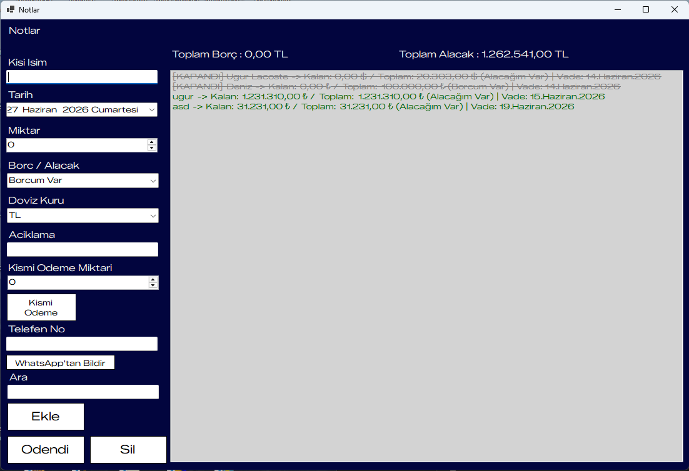
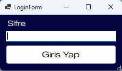

# 💰 BorcNot - Finansal Takip Uygulaması

Bu proje, kişisel borç ve alacakların takibini kolaylaştırmak, döviz kurlarını yönetmek ve borçlulara hızlıca bildirim göndermek amacıyla geliştirilmiş bir masaüstü yazılımıdır. 

## 🚀 Özellikler
* **Güvenli Giriş (Login System):** Kullanıcı şifre doğrulama katmanı.
* **Döviz Desteği:** TL, USD ve EUR cinsinden borç/alacak kaydı.
* **Gelişmiş Hesaplama:** Kısmi ödeme yapıldığında toplam borçtan dinamik olarak düşme ve kalan bakiye takibi.
* **WhatsApp Entegrasyonu:** Borçlu kişiye tek tıkla WhatsApp üzerinden durumu bildirebilme.
* **Durum Yönetimi:** Ödenen veya kapatılan borçların görsel olarak ayırt edilebilmesi.

## 🛠️ Kullanılan Teknolojiler
* **Dil:** C# (.NET Framework / WinForms)
* **IDE:** Visual Studio 2026
* **MSSQL:** Sql Server Management Studio 2022
 
## 📸 Ekran Görüntüleri

